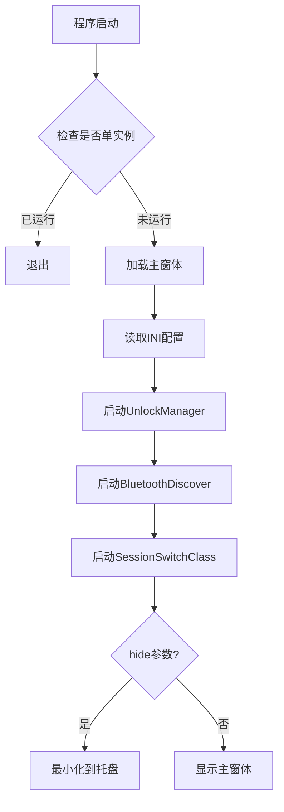
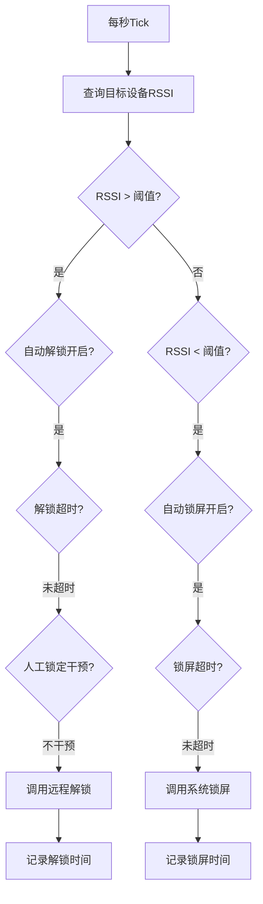

# UnlockServer 项目架构文档

## 📋 项目概述

**项目名称**: UnlockServer  
**项目类型**: Windows 桌面应用程序 (WinForms + .NET Framework)  
**主要功能**: 基于蓝牙设备信号强度的电脑自动锁屏/解锁工具  
**当前版本**: v1.4

### 核心特性

- 🔐 根据蓝牙设备信号强度(RSSI)自动锁定/解锁电脑
- 📡 支持经典蓝牙(Classic)和低功耗蓝牙(BLE)两种模式
- 🔒 支持远程解锁功能(通过 SSL TCP 连接)
- ⚙️ 可配置的锁屏/解锁超时机制
- 🚀 支持开机自启动
- 🎯 可选择是否干预人工锁定/解锁

---

## 🏗️ 项目结构

```
UnlockServer/
├── 📁 UnlockServer/                # 主项目目录
│   ├── 📄 Program.cs              # 程序入口
│   ├── 📄 Form1.cs                # 主窗体(UI)
│   ├── 📄 BtDeviceListForm.cs     # 蓝牙设备列表窗体
│   │
│   ├── 📁 Beans/                  # 数据模型
│   │   └── MybluetoothDevice.cs   # 蓝牙设备数据模型
│   │
│   ├── 📁 Utils/                  # 工具类集合
│   │   ├── UnlockManager.cs       # 解锁管理核心类
│   │   ├── BluetoothDiscover.cs   # 蓝牙设备发现与扫描
│   │   ├── SessionSwitchClass.cs  # 系统会话监控
│   │   ├── WanClient.cs           # 远程解锁客户端
│   │   ├── SslTcpClient.cs        # SSL TCP通信
│   │   ├── AESUtil.cs             # AES加密工具
│   │   ├── OperateIniFile.cs      # INI配置文件操作
│   │   └── AutoStartHelper.cs     # 开机自启动管理
│   │
│   └── 📁 Properties/             # 项目属性
│       ├── AssemblyInfo.cs
│       ├── Resources.resx
│       └── Settings.settings
│
├── 📁 packages/                    # NuGet包依赖
│   └── InTheHand.Net.Bluetooth.4.0.30/  # 蓝牙库
│
└── 📄 README.md                    # 项目说明文档
```

---

## 🔧 核心组件详解

### 1️⃣ **Program.cs** - 程序入口

**职责**:

- 应用程序启动入口
- 单实例检测(防止重复运行)
- 支持隐藏启动参数

**关键代码**:

```csharp
- checkIsSingle(): 使用互斥量(Mutex)确保单实例运行
- Main(): 支持 "hide" 参数实现后台启动
```

---

### 2️⃣ **Form1.cs** - 主窗体界面

**职责**:

- 用户界面主窗体
- 配置管理(加载/保存)
- 托盘图标管理
- 协调各个组件工作

**主要功能**:

- ✅ 配置服务器 IP、端口、用户名、密码
- ✅ 选择蓝牙设备及信号阈值
- ✅ 设置锁屏/解锁超时
- ✅ 开机自启动设置
- ✅ 实时显示蓝牙 RSSI 信号值

**关键方法**:

- `loadConfig()`: 加载 INI 配置
- `UpdategRssi()`: 更新 RSSI 显示
- `Form1_FormClosing()`: 最小化到托盘

---

### 3️⃣ **UnlockManager.cs** - 核心管理类 ⭐

**职责**: 整个解锁/锁屏逻辑的大脑

**核心流程**:

```
1. 启动蓝牙发现服务
2. 每秒轮询(Tick)检查蓝牙设备RSSI
3. 根据RSSI阈值判断设备远近
4. 触发锁屏或解锁操作
5. 遵守超时规则和人工干预设置
```

**关键属性**:

- `isautolock`: 是否自动锁屏
- `isautounlock`: 是否自动解锁
- `manuallock`: 不干预人工锁定
- `manualunlock`: 不干预人工解锁
- `rssiyuzhi`: RSSI 信号阈值(默认-90dBm)

**关键方法**:

- `Start()`: 启动监控循环
- `Tick()`: 每秒执行的核心逻辑
- `setunlockaddress()`: 设置目标蓝牙设备地址

**锁屏/解锁逻辑**:

```csharp
// 设备靠近(RSSI > 阈值) -> 解锁
if (rssi > rssiyuzhi && isautounlock) {
    // 检查解锁超时
    // 调用远程解锁服务
}

// 设备远离(RSSI < 阈值) -> 锁屏
if (rssi < rssiyuzhi && isautolock) {
    // 检查锁屏超时
    // 调用锁屏API
}
```

---

### 4️⃣ **BluetoothDiscover.cs** - 蓝牙发现服务

**职责**:

- 持续扫描蓝牙设备
- 监听设备添加/更新/移除事件
- 提供设备列表和 RSSI 查询

**技术实现**:

- 使用 Windows.Devices.Enumeration API
- 支持经典蓝牙(BluetoothId)和 BLE(BluetoothLEId)
- 使用 ConcurrentDictionary 线程安全存储设备

**关键方法**:

- `StartDiscover()`: 启动设备监听
- `StopDiscover()`: 停止监听
- `GetDeviceRssi()`: 获取指定设备 RSSI
- `GetAllDevices()`: 获取所有发现的设备

**事件处理**:

- `OnAdded`: 新设备发现
- `OnUpdated`: 设备信息更新(主要是 RSSI)
- `OnRemoved`: 设备移除

---

### 5️⃣ **SessionSwitchClass.cs** - 会话监控

**职责**:

- 监听 Windows 会话切换事件
- 区分软件锁屏和人工锁屏
- 执行锁屏/解锁后的回调

**监听事件**:

- `SessionLogon`: 用户登录
- `SessionUnlock`: 解锁屏
- `SessionLock`: 锁屏
- `SessionLogoff`: 注销

**关键属性**:

- `isUnlockBySoft`: 是否由软件解锁
- `isLockBySoft`: 是否由软件锁屏
- `dolocking`: 正在执行锁屏
- `dounlocking`: 正在执行解锁

---

### 6️⃣ **WanClient.cs** - 远程解锁客户端

**职责**:

- 通过网络调用远程解锁服务
- 调用 Windows API 锁定工作站
- 管理解锁配置信息

**关键方法**:

- `UnlockPc()`: 远程解锁电脑
- `LockPc()`: 调用系统锁屏 API
- `reloadConfig()`: 重新加载配置

**解锁流程**:

```
1. 读取配置(IP、端口、用户名、密码)
2. 构造JSON请求体
3. 通过SSL连接发送到服务器
4. 服务器验证身份后解锁
```

---

### 7️⃣ **BtDeviceListForm.cs** - 设备选择窗体

**职责**:

- 显示扫描到的蓝牙设备列表
- 实时更新设备 RSSI
- 设备排序和平滑处理

**优化特性**:

- ✅ RSSI 平滑算法(指数平滑)
- ✅ 防止列表跳动(限制重排频率)
- ✅ 保持用户选中状态

---

### 8️⃣ **工具类**

#### **AESUtil.cs** - AES 加密

- 提供配置信息的加密/解密
- 32 字节密钥管理
- 支持动态密钥生成

#### **OperateIniFile.cs** - INI 文件操作

- 读写 INI 配置文件
- 支持加密存储(通过 AESUtil)
- 类型安全的读写方法

#### **AutoStartHelper.cs** - 开机自启

- 使用 Windows 任务计划程序
- 创建/删除/检查启动任务
- 支持隐藏参数启动

---

## 🔄 核心工作流程

### 启动流程



### 解锁流程



---

## 🔐 安全机制

### 1. 配置加密

- 敏感信息(IP、密码)使用 AES 加密存储
- 动态生成并保存 32 字节密钥
- 基础密钥用于加密用户密钥

### 2. SSL 通信

- 远程解锁使用 SSL/TLS 加密传输
- 服务器证书验证

### 3. 超时保护

- 锁屏超时: 防止频繁锁屏(默认 60 秒)
- 解锁超时: 防止频繁解锁(默认 30 秒)

---

## 📊 数据流向

```
[蓝牙设备]
    ↓ (RSSI信号)
[BluetoothDiscover]
    ↓ (设备信息)
[UnlockManager]
    ↓ (判断距离)
    ├→ [WanClient] → [远程服务器] → 解锁电脑
    └→ [WinAPI] → 锁定电脑
                ↓
        [SessionSwitchClass] (监听锁屏事件)
                ↓
        [UnlockManager] (更新状态)
```

---

## 📝 配置文件(unlockserver.ini)

```ini
[setting]
ip=服务器IP(AES加密)
pt=端口号(AES加密)
us=用户名(AES加密)
pd=密码(AES加密)
base=密钥Base64(AES加密)
unlockaddress=蓝牙设备地址
rssiyuzhi=RSSI阈值(默认-90)
isautolock=是否自动锁屏
isautounlock=是否自动解锁
manuallock=不干预人工锁定
manualunlock=不干预人工解锁
locktime=锁屏超时(秒)
unlocktime=解锁超时(秒)
bletype=蓝牙类型(1=Classic, 2=BLE)
```

---

## 🔌 外部依赖

### NuGet 包

- **InTheHand.Net.Bluetooth** (4.0.30)
  - 提供跨平台蓝牙 API
  - 支持 Classic 和 BLE

### Windows API

- **Windows.Devices.Bluetooth**: UWP 蓝牙 API
- **Windows.Devices.Enumeration**: 设备枚举
- **Microsoft.Win32.SystemEvents**: 会话切换监听
- **TaskScheduler**: 任务计划程序(开机自启)

### .NET Framework API

- **System.Runtime.InteropServices**: P/Invoke 调用 Win32 API
- **System.Security.Cryptography**: AES 加密
- **System.Net.Security**: SSL/TLS 通信

---

## 🎯 关键技术点

### 1. 蓝牙 RSSI 监控

- 使用 Windows Device Enumeration API 持续扫描
- RSSI 值范围: -100dBm(远) 到 0dBm(近)
- 默认阈值-90dBm 适合大多数设备

### 2. 会话状态管理

- 区分软件锁屏和用户手动锁屏
- 通过标志位(`dounlocking`/`dolocking`)判断

### 3. 单实例控制

- 使用命名互斥量(Mutex)
- 防止重复启动造成冲突

### 4. 托盘程序设计

- 最小化到托盘而非关闭
- 支持双击托盘恢复窗口

---

## 🐛 常见问题处理

### Q1: 找不到蓝牙设备

- 确保设备蓝牙发现功能开启
- 部分设备需要断开手机连接
- Android 10+默认不可发现,需要插件

### Q2: 配对后无 RSSI

- 某些设备配对后无法获取 RSSI
- 需要解除配对,开启发现模式使用

### Q3: 频繁锁屏/解锁

- 调整 RSSI 阈值
- 增加锁屏/解锁超时时间
- 检查环境信号干扰

---

## 🔮 扩展建议

### 功能扩展

- [ ] 支持多设备同时监控
- [ ] 添加信号曲线图表
- [ ] 支持自定义锁屏/解锁命令
- [ ] 添加日志记录功能
- [ ] 支持更多解锁方式(人脸/指纹)

### 技术优化

- [ ] 迁移到.NET 6/7
- [ ] 使用 WPF/Avalonia 重构 UI
- [ ] 支持云端配置同步
- [ ] 添加单元测试

---

## 📚 相关文档

- [README.md](README.md) - 项目说明和使用指南
- [InTheHand.Net.Bluetooth 文档](https://github.com/inthehand/32feet) - 蓝牙库文档

---

## 👥 开发者信息

- **作者**: zixing131
- **仓库**: [UnlockServer](https://github.com/zixing131/UnlockServer)
- **许可**: 参见 LICENSE 文件

---

## 📅 版本历史

### v1.4

- 添加锁屏超时(60 秒)
- 添加解锁超时(30 秒)

### 早期版本

- 基础蓝牙解锁功能
- 支持 Classic 和 BLE
- 远程解锁集成

---

**文档生成时间**: 2025 年 12 月 7 日  
**文档版本**: 1.0
